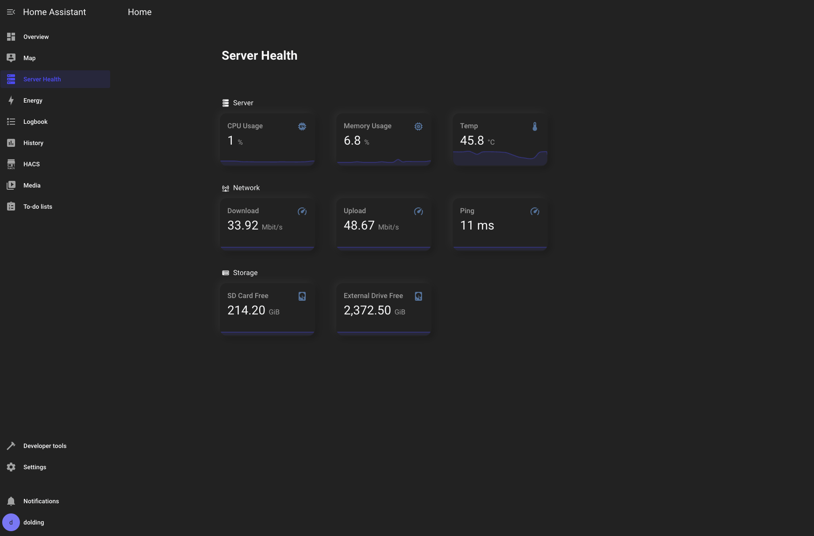

# Raspberry Pi - Home Assistant Setup - Deep Dive/Complete Tutorial
Code used within the Raspberry Pi - Home Assistant Setup video,

Youtube Video: https://youtu.be/R6G37OEW4is

[](https://youtu.be/R6G37OEW4is)


Commands to run the container

```
docker compose up -d
```


##

## Files
<b>Dockerfile</b> -- used to build the home assistant docker image

<b>docker-compose.yaml</b> - used to configure the docker container

<b>backup-script.sh</b> - used to backup the entire home assistant setup via a shell script using a cron job

<b>server-health-dashboard</b> - is the final dashboard we created to monitor our server health


