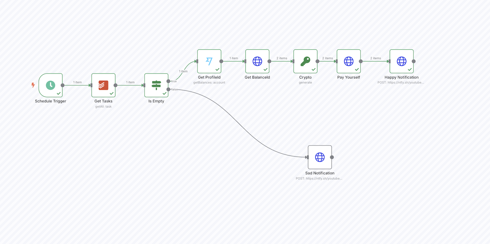

# My To Do List Pays Me - n8n Automation
Here are detailed instructions with websites and syntaxes used within the video to help make life easier for you.

Youtube Video: https://youtu.be/MGQI3VQbAmA

[](https://youtu.be/MGQI3VQbAmA)


## Websites
n8n         https://n8n.io

n8n github  https://github.com/n8n-io/n8n

docker      https://www.docker.com

todoist     https://app.todoist.com

ntfy        https://ntfy.sh


up banking open issues to allow payments and transfers directly via api
https://github.com/up-banking/api/issues/16
https://github.com/up-banking/api/issues/132


## Steps

<b>Get BalanceId</b>
Method: ```GET```
URL: ```https://api.wise.com/v4/profiles/{{ $json.profileId }}/balances?types=STANDARD,SAVINGS```

<b>Crypto</b>
Action: ```Generate```
Property Name:```X-idempotence-uuid```
Type: ```UUID```

<b>Pay Yourself</b>
Method: ```POST```
URL: ```https://api.wise.com/v2/profiles/{{ $('Get ProfileId').item.json.profileId }}/balance-movements```

Header Parameters to send
Name: ```Authorization```
Value: ```Bearer {API_TOKEN}```

Name: ```X-idempotence-uuid```
Value: ```{{ $json['X-idempotence-uuid'] }}```

Name: ```Content-Type```
Value: ```application/json```

Body values to send
JSON
```
{
  "sourceBalanceId": YOUR_JAR_OR_SAVINGS_ACC,
  "targetBalanceId": YOUR_TRANSACTION_ACC,
  "amount": {
    "value": AMOUNT_TO_SEND_IN_DECIMAL_FORMAT,
    "currency": "CURRENCY_TO_USE"
}
```


</br>
</br></br>

## Final Product

