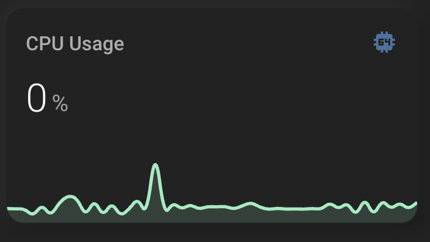

# Home Assistant Themes And Custom Cards
I've included the yaml code for the custom graph used within this video.

Note: You can use any entity id that you have... if you want CPU metrics like in this example you may first have to enable the collection of that via host metrics.

I've documented that process in another video here 👉 https://youtu.be/7lXjJefo7bI

## Home Assistant Themes And Custom Cards Youtube Video
https://youtu.be/qh9JJXJsGL0

